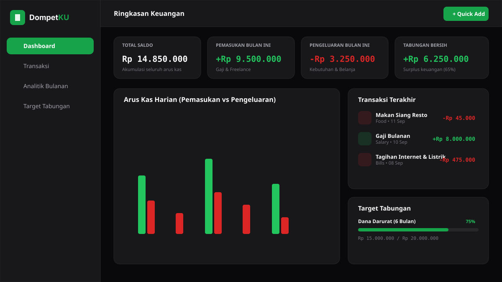
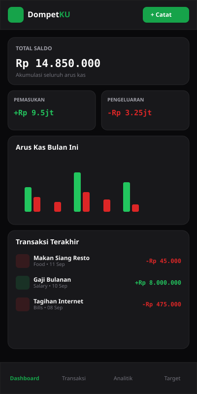

# DompetKU

Aplikasi web pencatat keuangan pribadi untuk mengelola pemasukan, pengeluaran, dan target tabungan bulanan. Dilengkapi visualisasi analitik dan ekspor laporan PDF.

## Screenshot

### Desktop


### Mobile
<p align="center">
  
</p>

## Tech Stack

- **Framework**: Next.js 15 (App Router, Server Actions)
- **Library UI**: React 19, Tailwind CSS, Lucide React
- **Bahasa**: TypeScript (Strict Mode)
- **Database & Auth**: Supabase PostgreSQL, `@supabase/ssr` (Row Level Security)
- **Form & Validasi**: React Hook Form, Zod
- **Visualisasi Data**: Recharts
- **Ekspor Dokumen**: jsPDF, jspdf-autotable
- **State & Tema**: next-themes, Sonner

## Fitur

- **Autentikasi**: Registrasi, login, logout, dan proteksi rute berbasis session Supabase SSR.
- **Dashboard**: Ringkasan saldo total, pemasukan, pengeluaran, net balance bulanan, transaksi terbaru, dan modal quick-add.
- **Manajemen Transaksi**:
  - CRUD transaksi pemasukan dan pengeluaran.
  - Filter berdasarkan tipe (income/expense), kategori, dan rentang tanggal.
  - Pencarian real-time pada judul dan catatan transaksi.
  - Format angka otomatis ke Rupiah (IDR).
- **Analitik Keuangan**:
  - Bar chart pemasukan vs pengeluaran bulanan.
  - Donut chart distribusi pengeluaran per kategori dengan persentase.
  - Line chart akumulasi saldo harian sepanjang bulan berjalan.
  - Komparasi histori keuangan 6 bulan terakhir.
- **Target Tabungan (Savings Goals)**:
  - Tracking nominal target, saldo terkumpul, dan tenggat waktu.
  - Indikator persentase progres tabungan.
  - Modal setoran cepat langsung ke saldo tabungan.
- **Ekspor PDF**:
  - Download laporan keuangan bulanan lengkap (ringkasan metrik, distribusi kategori, tabel transaksi).
  - Diproses di sisi klien tanpa dependensi server eksternal.
- **Dark Mode**: Dukungan tema gelap dan terang dengan penyimpanan preferensi pengguna.

## Skema Database

Aplikasi menggunakan PostgreSQL pada Supabase dengan Row Level Security (RLS) aktif di seluruh tabel:

- `profiles`: Data profil pengguna yang terhubung dengan `auth.users` via trigger otomatis.
- `transactions`: Rekap transaksi pemasukan dan pengeluaran (`user_id`, `amount`, `type`, `category`, `transaction_date`).
- `savings_goals`: Target tabungan per user (`user_id`, `goal_name`, `target_amount`, `current_amount`, `deadline`).

File skema lengkap tersedia di [`supabase/schema.sql`](./supabase/schema.sql).

## Cara Menjalankan

### 1. Clone repository

```bash
git clone https://github.com/username/dompetku.git
cd dompetku
```

### 2. Install dependensi

```bash
npm install
```

### 3. Konfigurasi Environment

Salin file template environment:

```bash
cp .env.example .env.local
```

Isi variabel dengan kredensial dari project Supabase Anda:

```env
NEXT_PUBLIC_SUPABASE_URL=https://your-project.supabase.co
NEXT_PUBLIC_SUPABASE_ANON_KEY=your-anon-key
```

### 4. Setup Database Supabase

Buka menu **SQL Editor** pada dashboard Supabase, lalu jalankan seluruh isi file [`supabase/schema.sql`](./supabase/schema.sql).

### 5. Jalankan Development Server

```bash
npm run dev
```

Buka `http://localhost:3000` pada browser.

## Struktur Direktori

```text
src/
├── app/                  # Route handlers, pages, layout, dan server actions
│   ├── (auth)/           # Route login & register
│   ├── analytics/        # Halaman visualisasi data
│   ├── api/              # API endpoints
│   ├── goals/            # Halaman savings goals
│   └── transactions/     # Halaman CRUD transaksi
├── components/           # UI components (dashboard, charts, forms, layout)
├── lib/
│   ├── db/               # Query data Supabase
│   ├── pdf/              # Generator dokumen jsPDF
│   ├── supabase/         # Client, server, dan middleware Supabase
│   ├── utils/            # Helper format mata uang dan tanggal
│   └── validations/      # Skema validasi Zod
└── types/                # TypeScript interface dan tipe database
supabase/
└── schema.sql            # Definisi DDL, RLS policies, dan PostgreSQL triggers
```

## Lisensi

MIT
